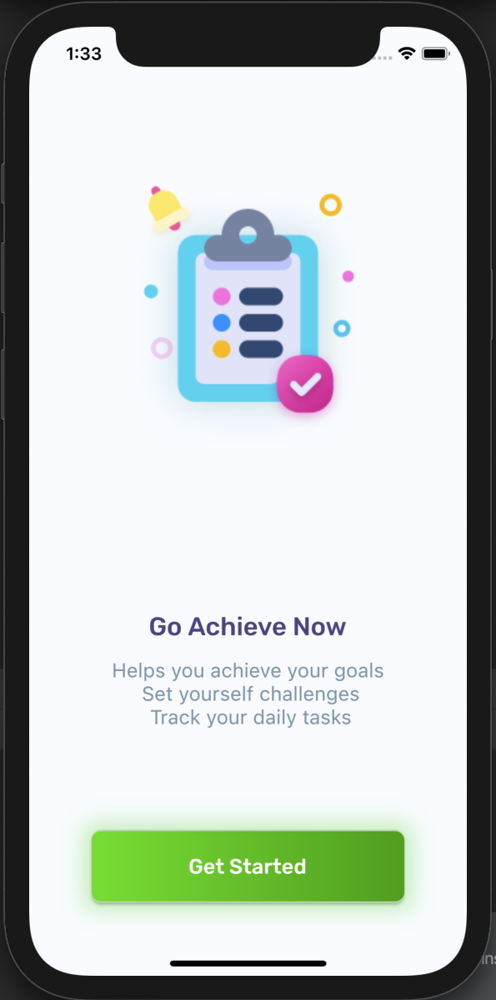
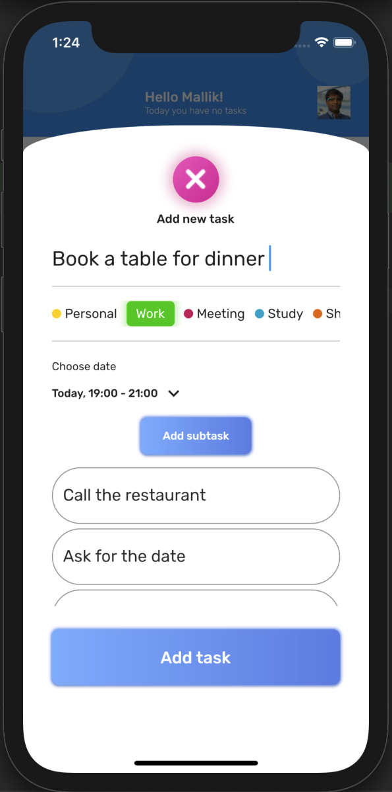
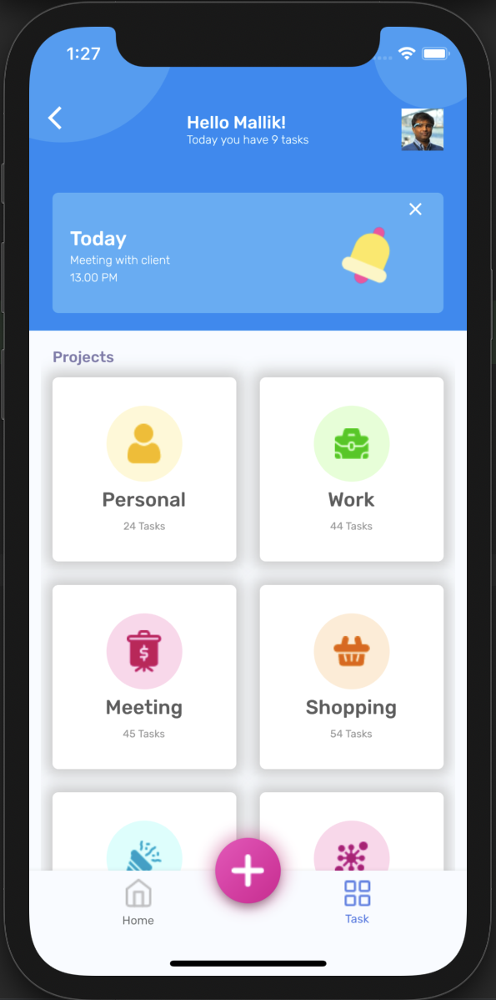

# ✔️ Flutter GAN App 
A Flutter GAN App
Go Achieve Now

Achieve Your Goals
Manage Tasks
Assign Tasks Some one else
Create Informal Reviews
And More to come...

## Getting Started

```shell
- Clone the repo
- Install the dependicies
- Run it
```









#Planning to implement the Couchbase Lite for local data storage (off line access and store)

https://docs.couchbase.com/sync-gateway/current/introduction.html


##Couchbase Server Host Ports
    For mobile deployment on premise or in the cloud (for example, AWS or Red Hat) open the following ports on the host to enable Couchbase Server to operate correctly:
    8091 to 8094 inclusive
    11207, 11210 and 11211
    18091 to 18093 inclusive.
    Check that any firewall configuration allows communication on the specified ports.


## Configure Server for Sync Gateway
    STEP 1 Create a Bucket on Server
    STEP 2 Create RBAC User
    STEP 3 Set-up Network Access


## Version history

| Version |       Date         |             Comments             |
| ------- | ------------------ | -------------------------------- |
| 1.0     | ~September 2021    | Initial release                  |

(Based on the design of the To Do App, created by Rudi Hartono)